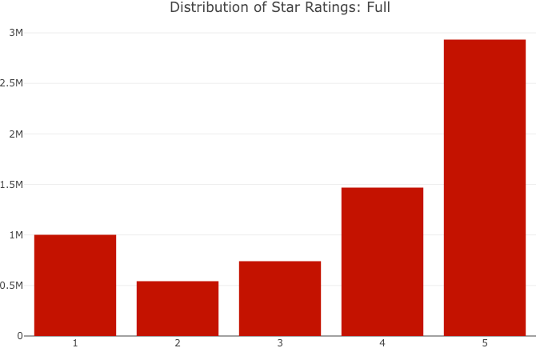
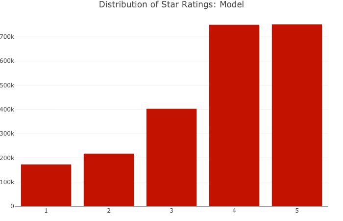
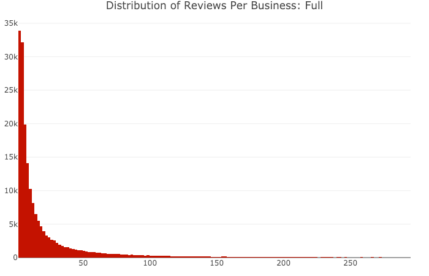
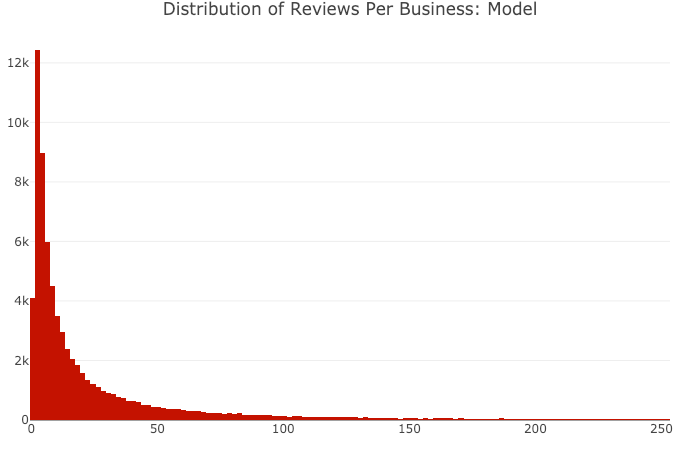
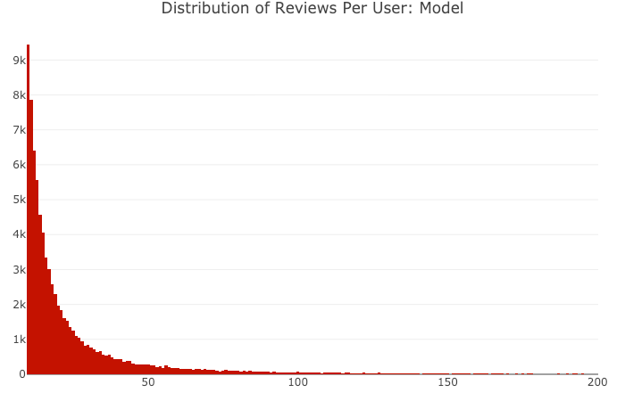

# Yelp Restaurant Recommendation System

This recommendation system uses data from the Yelp Open Dataset, available [here](https://www.yelp.com/dataset).

## 1. The Data

The full dataset includes:
* 6,685,900 reviews for 192,609 businesses by 1,637,138 users

The data used for training the recommendation system filtered this raw data down to only reviews for restaurants, and only reviews by users who gave 10 or more reviews:
* 2,295,089 reviews for 73,100 businesses by 81,416 users

## 2. Exploratory Data Analysis

Two graphs per distribution showing the difference in the data in the complete dataset and the data used to train the model.

### a. Distribution of Ratings

### b. Distribution of Reviews per Business

### c. Distribution of Reviews per User

## 3. The Recommendation System

The recommendation system is built on a Singular Value Decomposition model from [**surprise**](https://surprise.readthedocs.io/en/stable/index.html).

* The base model (default hyperparameters) returned error metrics **RMSE = 1.0917 and MAE = 0.8587**, and took ~20 minutes to train with 5-fold validation
* After tuning hyperparameters over several interations of GridSearch, final error metrics **RMSE = 1.0780 and MAE = 0.8495**, taking 48 seconds training on 80% of the full dataset and testing on the remaining 20%
* This means on average, the recommender predicts a rating between 1 and 5 with an error of 0.85 stars

#### Version 1 (02/07/2019):
Pick a user, the app shows the reviews the user's already made, and makes the same number of recommendations with Google Maps links to the recommended restaurants.

